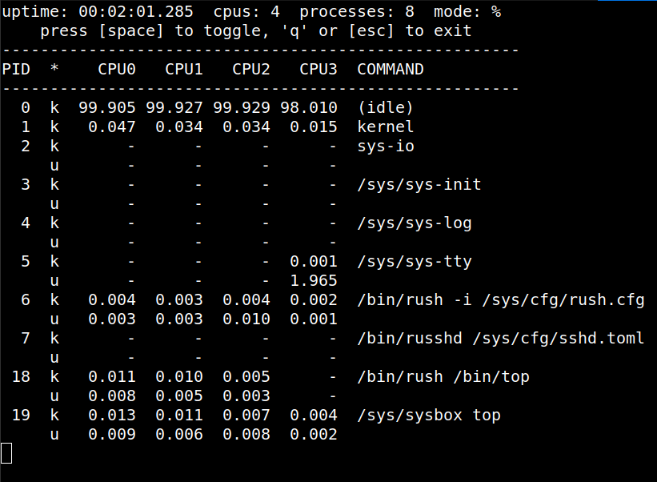
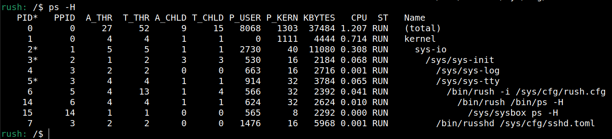

# Tools/commands available in Motor OS

## VM running helpers

After successfully [building Motor OS image](https://github.com/moturus/motor-os/tree/main/docs),
`$MOTORH/motor-os/vm_images/[debug|release]` directory will contain several data files
and several useful scripts:

- `motor.full.img` contains the "full" image of Motor OS, i.e. all system tools in
  addition to the sample Motor OS website;
- `motor.web.img` contains a minimal image of Motor OS that will start serving the
  sample Motor OS website on boot;
- `create-tap.sh` is a script to create a local ipvtap device that will be used
  by the VM for networking;
- `run-qemu.sh` and `run-chv.sh` will run the "full" VM version in Qemu or Cloud Hypervisor;
- `run-web-qemu.sh` and `run-web-chv.sh` will run the "web" VM versions.

## Tools available inside the Motor OS VM

The "full" Motor OS VM will boot into a unix-like shell [rush](https://github.com/moturus/rush).
The shell is somewhat barebones now (contributions are welcome!).

- `ls bin` will show all commands in the `$PATH`;
- `free`, `kill`, `ps`, `ss`, and `top` are worth mentioning;
- `/sys/tests/systest`, `/sys/tests/mio-test`, and `/sys/tests/tokio-tests` are useful
  to make sure everything is working as expected;
- `/sys/logs` directory contains some occasionally useful logs;
- `/sys/mdbg print-stacks $PID`, where `$PID` can be deduced by running `ps`, will
  (attempt) to extract stack traces for all threads in the process; the stack traces
  are addresses, so `addr2line` will need to be used with the binary
  (e.g. `$MOTORH/motor-os/build/obj/sys-io/x86_64-unknown-motor/debug/sys-io`);
  - stack traces reaching into the VDSO object will be marked as so, and can be symbolized
  using `addr2line` applied to `$MOTORH/motor-os/build/obj/vdso/x86_64-unknown-motor/debug/rt`.

