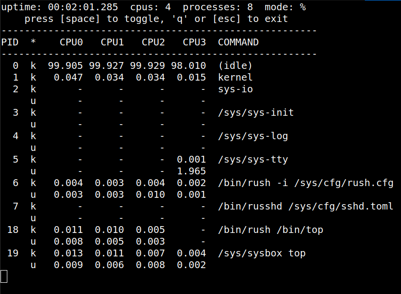
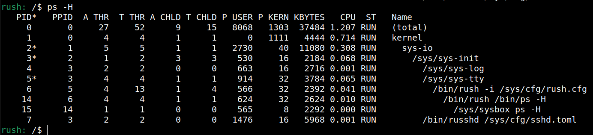

# Tools/commands available in Motor OS

## VM running helpers

After successfully [building Motor OS image](./build.md),
`$MOTORH/motor-os/vm_images/[debug|release]` directory will contain several data files
and several useful scripts:

- `motor-os-base.img` contains the minimal bootable system and user shell tools;
- `motor-os.qcow2` is the standard production image, adding networking, DNS, and
  regular user programs;
- `motor-os-dev.qcow2` adds native toolchains, sources, diagnostics, tests, and
  the bundled sample website;
- `create-tap.sh` creates the local `moto-tap` interface the VMs use for
  networking and the NAT rules that let them reach the Internet; the build runs
  the same steps, so it is needed only after a host reboot;
- `run-qemu.sh` and `run-chv.sh` run the image selected by `MOTO_IMAGE`; it
  defaults to `motor-os.qcow2`. QEMU and Cloud Hypervisor also accept the raw
  base image; Firecracker supports only that raw image.

## Tools available inside the Motor OS VM

This is how `top` looks like:



Motor OS boots into a unix-like shell [rush](https://github.com/moturus/rush).
The shell is somewhat barebones now (contributions are welcome!).

- `ls /system/bin` and `ls /user/bin` show the standard commands; the
  development image also places `/devtools/bin` on `PATH`;
- `free`, `kill`, `ping`, `printenv`, `ps`, `ss`, and `top` are worth mentioning;
- `ping [-c COUNT] [-i SECONDS] [-W SECONDS] [-s BYTES] DESTINATION` supports
  numeric IPv4 and IPv6 addresses, `localhost`, and DNS names;
- On the development image, `/devtools/tests/systest`,
  `/devtools/tests/mio-test`, and `/devtools/tests/tokio-tests` are useful to
  make sure everything is working as expected;
- `/system/logs` contains current and rotated service logs. Interactive
  sessions can list and read them, System-role strobe alone creates and rotates
  them, and None-role processes cannot traverse the directory. The unfiltered
  kernel stream is `/system/logs/kernel.log`; its previous 4 MiB generation is
  `kernel.log.prev`. Strobe applies the same size bound to every tag and removes
  the oldest `.prev` files when free space falls below 50 MiB. Runtime
  diagnostics go to the process's stderr first, including debug records when
  debug logging is configured; for these diagnostics, the kernel log is a
  capability-gated fallback when that write fails;
- `/devtools/bin/mdbg print-stacks $PID`, where `$PID` can be deduced by running `ps`, will
  (attempt) to extract stack traces for all threads in the process; the stack traces
  are addresses, so `addr2line` will need to be used with the binary
  (e.g. `$MOTORH/motor-os/build/obj/sys-io/x86_64-unknown-motor/debug/sys-io`);
  - stack traces reaching into the VDSO object will be marked as so, and can be symbolized
  using `addr2line` applied to `$MOTORH/motor-os/build/obj/vdso/x86_64-unknown-motor/debug/rt`.



## Git on the developer image

The developer image includes `gix` in `/devtools/bin`. Its initial command set
can initialize or clone an ordinary SHA-1 worktree, update a configured remote,
inspect it, and stage local changes:

```sh
gix init scratch
gix clone https://example.test/project.git project
gix -r project status
gix -r project add src/main.rs
gix -r project add -A
gix -r project log
gix -r project fetch            # fetches origin
gix -r project fetch upstream
```

`init` creates `.git` exclusively while preserving existing files in `DIR`,
which defaults to the current directory. It refuses to reinitialize a
repository. The initial branch is
`init.defaultBranch` when configured and `main` otherwise.

`add PATH…` stages literal paths relative to the selected worktree; use `--`
for names starting with a dash. `add -A` stages all additions, changes and
deletions. Tracked ignored files are included; explicitly naming an ignored
or unmatched path fails. Executable and indexed symlink modes are preserved.
Gitlinks are left unchanged. Staging refuses external filters and files over
16 MiB, and publishes the index only after all selected changes are prepared.

`fetch` updates remote-tracking references and tags without changing the current
branch, index or worktree. HTTPS uses the system CA bundle. A test or private CA
can be selected explicitly with
`gix -c http.sslCAInfo=/path/to/ca.pem clone URL DIR`; repository configuration
cannot disable certificate verification or replace the trust roots.

Clone creates `DIR` exclusively and never adopts an existing directory.
A failed clone retains its owned directory for inspection; the
`.git/gix-incomplete-clone` marker identifies unfinished fetch or checkout.
Remove that owned directory explicitly before cloning again. Repository paths
must be UTF-8 and valid Motor file names; the current path policy also rejects
Windows-reserved names and characters. Because Motor OS has no symbolic links,
link entries are checked out as regular files containing their target text. This command set does
not yet include commit, push, or SSH remotes.

For more details, see [https://motor-os.org](https://motor-os.org).
